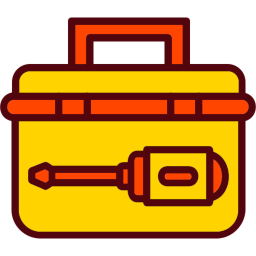

#  Syno Toolbox

<!---  --->

### Description

Synology package containing many 007revad scripts that are too small to have their own package, as well as new ones that were never released as a script.

Available for DSM 7 and DSM 6. Supports x86_64, aarch64, armv7l and i686.

### How to install the package

There are 2 ways to install the package:

**Directly from Package Center**

1. Add [007revad Synology Package Source](https://github.com/007revad/Synology_package_source) to package Center.
2. Click on the Community section in Package Center and install the package.

<kbd></kbd>

**Or download the package and install it manually**
1. Download the latest version .spk file from https://github.com/007revad/Syno_Toolbox/releases and save it to your Synology.
2. In Package Center click on Manual Install.
3. Browse to where you downloaded the .spk file.
4. Select the .spk file and click Next.

### Screenshots

<!--- 
Description of image 1 goes here
 --->

<kbd></kbd>

 

DS925+ Info (UPS client)

<kbd></kbd>

 

DS1821+ Info (UPS server)

<kbd></kbd>

 

Tools

<kbd></kbd>

 

More Tools

<kbd></kbd>

 

Send WOL device selection

<kbd></kbd>

 

Send WOL Settings

<kbd></kbd>

 

Packages

<kbd></kbd>

