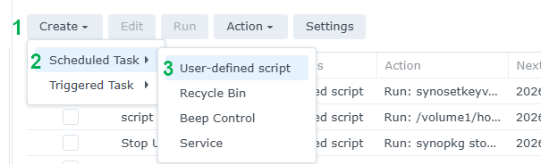
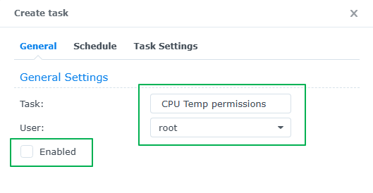
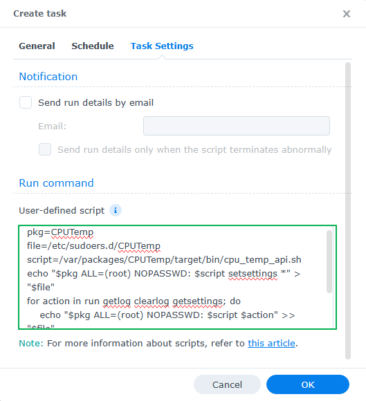
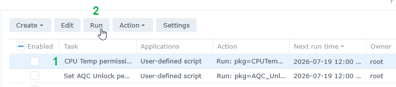

## How to set the package permissions

There are 2 ways you can set the required permissions for the package.

### Set package permissions via SSH

```
sudo -i
pkg=CPUTemp
file=/etc/sudoers.d/CPUTemp
script=/var/packages/CPUTemp/target/bin/cpu_temp_api.sh
echo "$pkg ALL=(root) NOPASSWD: $script setsettings *" > "$file"
for action in run getlog clearlog getsettings; do
    echo "$pkg ALL=(root) NOPASSWD: $script $action" >> "$file"
done
chmod 0440 "$file"
cat "$file"
```

### Set package permissions in Synology Task Scheduler

1. Go to **Control Panel** > **Task Scheduler** > click **Create** > and select **Scheduled Task**.
2. Select **User-defined script**.
3. Enter a task name.
4. Select **root** as the user (Syno CPU Temperature needs to run with elevated permissions).
5. Untick **Enable** so it does **not** run on a schedule.
6. Click **Task Settings**.
7. In the box under **User-defined script** copy and paste the following. 
    ```
    pkg=CPUTemp
    file=/etc/sudoers.d/CPUTemp
    script=/var/packages/CPUTemp/target/bin/cpu_temp_api.sh
    echo "$pkg ALL=(root) NOPASSWD: $script setsettings *" > "$file"
    for action in run getlog clearlog getsettings; do
        echo "$pkg ALL=(root) NOPASSWD: $script $action" >> "$file"
    done
    chmod 0440 "$file"
    cat "$file"
    ```
8. Click **OK** to save the settings.
9. Click on the task - but **don't** enable it - then click **Run**.
10. Once the script has run you can delete the task, or keep in case you need it again.

**Here's some screenshots showing what needs to be set:**

<p align="center">Step 1</p>
<p align="center"><kbd></kbd></p>

<p align="center">Step 2</p>
<p align="center"><kbd></kbd></p>

<p align="center">Step 3</p>
<p align="center"><kbd></kbd></p>

<p align="center">Step 4</p>
<p align="center"><kbd></kbd></p>
